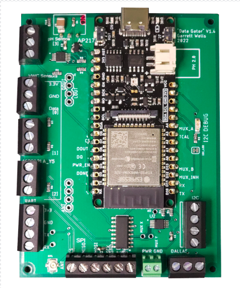

# Data Gator
Aggregator firmware for Project VineHeart as a PlatformIO project.

- [Fast Start: Compiling and Uploading Firmware to a Board](#fast-start:-compiling-and-uploading)
- [Documentation and Guides](#documentation)

# Aggregators/Data Gators
Aggregators collect sensor data from a variety of sensors(wired and wireless) and publish the data via MQTT messages to a broker. The aggregators have been dubbed the "Data Gators". A example of the aggregator/Data Gator hardware is shown below:

# Documentation
Firmware and pertinent hardware documentation can be found in [`documentation/`](documentation/README.md) in this repository. This directory will contain generic firmware documentation as well as directories with documentation specific to certain versions of hardware/firmware as needed.

| Documentation | Contents | 
| :---: | :---: | 
| [Project Summary](documentation/README.md) | Summary of hardware and firmware features. |
| [Sensor Hookup Guides](documentation/sensors_and_wiring/README.md) | Resources for acquiring and using sensors that are supported by this project. |
| [MQTT and Hardware Documentation Spreadsheet](documentation/MQTT_Hardware_Documentation.xlsx) | Description of MQTT topics and hardware interfaces. |
| [Espressif Binary Flash Tool for Windows](documentation/Espressif_Flash_Download_Tool.md) | Download links and guide for how to flash firmware releases to the hardware using Espressif's flash tool for Windows. |

### Fast Start: Compiling and Uploading
1. To build and upload the current code to the board without modifying:

        pio run -t upload
        // OR open serial monitor afterward
        pio run -t upload -t monitor

2. To generate `include/config.h` with selected network parameters:

        pio run -e config-firebeetle32

### Unit Tests

Unit tests have been added to allow verification of firmware and hardware functionality. To use unit tests, connect the aggregator board to your laptop via USB and run the following command from the root of this directory:

    pio test

This will run **all** unit tests on the board and print the results to the terminal sans debug messages. To see more debug information run with option `-v`, `-vv`, or `-vvv` depending on how much information you need.

Finally, if you only want to run a specific test use the following commands:

    # to see list of available tests
    pio test --list-tests

    # to run desired test 
    pio test -f <test_name>

###### NOTE
Further documentation on this command and PlatformIO's unit testing features can be found under these links:

* [PlatformIO Test Runner](https://docs.platformio.org/en/latest/advanced/unit-testing/runner.html)
* [`pio test` Command Documentation](https://docs.platformio.org/en/latest/advanced/unit-testing/runner.html)

