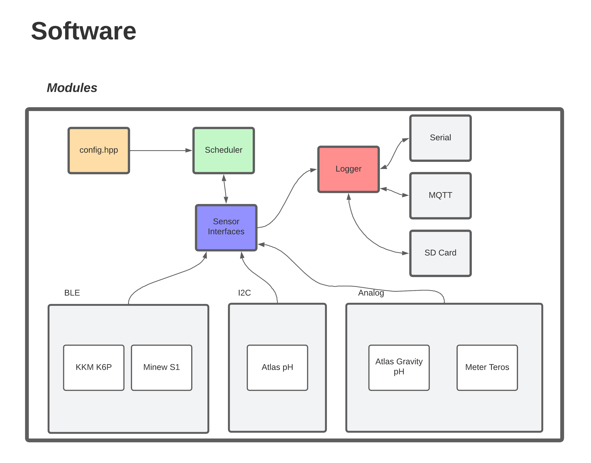

# Data Gator
Aggregator firmware for Project VineHeart as a PlatformIO project.

- [Fast Start: Compiling and Uploading Firmware to a Board](#fast-start-compiling-and-uploading)
- [Firmware Documentation and Guides](#documentation)

# Aggregators/Data Gators
Aggregators collect sensor data from a variety of sensors(wired and wireless) and publish the data via MQTT messages to a broker. The aggregators have been dubbed the "Data Gators". A example of the aggregator/Data Gator hardware is shown below:

# Documentation
Firmware and pertinent hardware documentation can be found in [`documentation/`](documentation/README.md) in this repository. This directory will contain generic firmware documentation as well as directories with documentation specific to certain versions of hardware/firmware as needed.

| Documentation | Contents | 
| :---: | :---: | 
| [**Recommended:** Firmware Documentation](documentation/README.md) | The complete documentation for using, managing, and developing firmware for the Data Gator using the code in this repository. |
| [MQTT and Hardware Documentation Spreadsheet](documentation/MQTT_Topics.md) | Description of MQTT topics and hardware interfaces. |
| [Espressif Binary Flash Tool for Windows](documentation/Espressif_Flash_Download_Tool.md) | Download links and guide for how to flash firmware releases to the hardware using Espressif's flash tool for Windows. |

# Architecture Description

## High-Level Hardware Description
Hardware documentation in [github pages](https://data-gator.github.io/Hardware).

1. The Micro-Controller(MCU)
    * currently an ESP32 based MCU with WiFi, BLE, and GPIO for interfacing with sensors
    * soldered to a carrier board which provides expanded functionality and better connection options 

2. The Carrier Board(Data Gator)
    * soldered to the MCU, it provides an improved Analog-to-Digital-Converter(ADC), power management chips, and Watch-Dog Timer(WDT)
    * the carrier board also provides interfaces for robust and re-usable connection to wired sensors

3. The Solar System
    * intended to be used with a battery, solar power manager, and solar panel to provide year-round sustainable operation
    * also includes a fuel gauge solution(MAX17048) to monitor battery charge level
    * requires a 1-2 Watt solar panel

## Firmware Configuration and Usage
The firmware is based around a modular architecture which is divided into several main parts:

1. Sensor Interfaces
    * each physical sensor is abstracted in firmware through its own library and extends one of the sensor APIs ([BLESensor](https://data-gator.github.io/doxygen_firmware_docs/classBLESensor.html), etc)

        * example: [Teros10](https://data-gator.github.io/doxygen_firmware_docs/classTeros10.html) extends [VWCSensor](https://data-gator.github.io/doxygen_firmware_docs/classVWCSensor.html)

    * a sensor's library/firmware is responsible for reading data from the hardware interface it is connected to (I2C, BLE, analog, etc)
    * sensor interfaces can be easily modified to add support for new sensor hardware without substantial changes to other firmware code - just make sure the MQTT subscriber picks up the new topics! 

2. Task Scheduling
    * one **task** is defined for each hardware sensor interface (analog, I2C, BLE, etc)
    * `config.hpp` defines the polling frequency for the tasks in minutes, but should not be edited directly if possible. It is better to follow the instructions from the guide in the table of contents above titled "Configuration Files and Profiles"
    * the MCU is woken from deep sleep by the WDT to check the scheduling table and execute scheduled tasks

        * time elapsed between tasks is estimated by counting WDT resets (approx. once every 64 seconds).

3. Data Logging
    * the logging module supports automatic logging to any of the specified interfaces such as Serial connection, MQTT(WiFi), SD card, and potentially LoRa (future)
    * logging destination is automatically chosen by the module based on what interfaces are available

Further documentation and usage information will be defined in [firmware_documentation.md](firmware_documentation.md). 

## Hardware Debugging and Documentation
Hardware characteristics of the system will be documented in [MQTT_Hardware_Documentation.xlsx](MQTT_Hardware_Documentation.xlsx), especially during development as new features are being added.

Stable feature documentation will later be accessible through [hardware_documentation.md](hardware_documentation.md).

### Fast Start: Compiling and Uploading
1. To build and upload the current code to the board without modifying:

        pio run -t upload
        // OR open serial monitor afterward
        pio run -t upload -t monitor

2. To generate `include/config.h` with selected network parameters:

        pio run -e config-firebeetle32

### Unit Tests

Unit tests have been added to allow verification of firmware and hardware functionality. To use unit tests, connect the aggregator board to your laptop via USB and run the following command from the root of this directory:

    pio test

This will run **all** unit tests on the board and print the results to the terminal sans debug messages. To see more debug information run with option `-v`, `-vv`, or `-vvv` depending on how much information you need.

Finally, if you only want to run a specific test use the following commands:

    # to see list of available tests
    pio test --list-tests

    # to run desired test 
    pio test -f <test_name>

###### NOTE
Further documentation on this command and PlatformIO's unit testing features can be found under these links:

* [PlatformIO Test Runner](https://docs.platformio.org/en/latest/advanced/unit-testing/runner.html)
* [`pio test` Command Documentation](https://docs.platformio.org/en/latest/advanced/unit-testing/runner.html)
