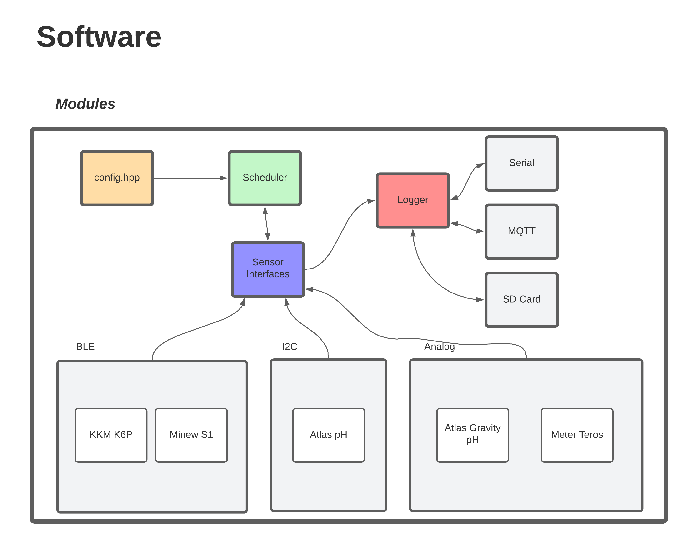
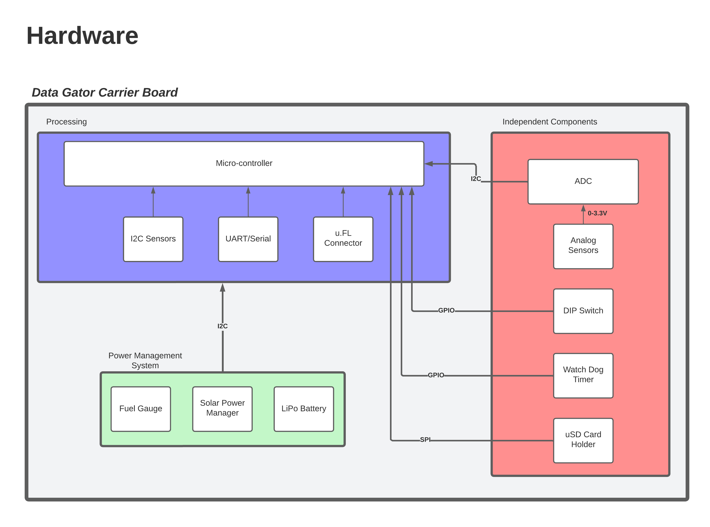

# Data Gator Documentation
This directory contains reference documentation for the aggregator hardware and firmware solutions. See the sections below for a quick overview of configuration options and description of how to find the information you are looking for.

##### Table of Contents

- [Configuration Files and Profiles](Configuration_Files_and_Creating_Profiles.md)
- [Espressif Flash Tool](Espressif_Flash_Download_Tool.md)
- [Building and Flashing Firmware](How_to_Flash_Firmware.md)
- [How to Access Logged Data](How_To_Access_Logged_Data.md)
- [MQTT Topics](MQTT_Topics.md)
- [Sensor Guides](sensors_and_wiring/README.md)
- [How to Make Releases](./how_to_make_releases.md)

### High-Level Hardware Description
The hardware solution can be broken into several discrete components:

1. The Micro-Controller(MCU)
    * currently an ESP32 based MCU with WiFi, BLE, and GPIO for interfacing with sensors
    * soldered to a carrier board which provides expanded functionality and better connection options 

2. The Carrier Board(Data Gator)
    * soldered to the MCU, it provides an improved Analog-to-Digital-Converter(ADC), Multiplexer(MUX), power management chips, and Watch-Dog Timer(WDT)
    * the carrier board also provides screw-terminal interfaces for robust and re-usable connection to wired sensors 

3. The Solar System
    * intended to be used with a battery, solar power manager, and solar panel to provide year-round sustainable operation
    * also includes a fuel gauge solution(MAX17048) to monitor battery charge level
    * requires a 1-2 Watt solar panel

### Firmware Configuration and Usage
The firmware is based around a modular architecture which is divided into several main parts:

1. Sensor Interfaces
    * sensor interfaces are defined for Bluetooth Low Energy temperature and humidity sensors, Volumetric Water Content(VWC) sensors, and pH sensors
    * sensor interfaces are based around the protocol/connection type that they use(I2C, BLE, analog, etc)
    * sensor interfaces can be easily modified to add support for new sensor hardware without substantial changes to other firmware code - just make sure the MQTT subscriber picks up the new topics! 

2. Task Scheduling
    * one task is defined for each sensor that the aggregator is connected to 
    * `config.hpp` defines the polling frequency for the tasks in minutes, but should not be edited directly if possible. It is better to follow the instructions from the guide in the table of contents above titled "Configuration Files and Profiles"
    * the MCU is woken from deep sleep by the WDT to check the scheduling table and execute scheduled tasks

3. Data Logging
    * the logging module supports automatic logging to any of the specified interfaces such as Serial connection, MQTT(WiFi), SD card, and potentially LoRa
    * logging destination is automatically chosen by the module based on what interfaces are available

Further documentation and usage information will be defined in [firmware_documentation.md](firmware_documentation.md). A flowchart of the modules can be seen below.

### Hardware Debugging and Documentation
Hardware characteristics of the system will be documented in [MQTT_Hardware_Documentation.xlsx](MQTT_Hardware_Documentation.xlsx), especially during development as new features are being added.

Stable feature documentation will later be accessible through [hardware_documentation.md](hardware_documentation.md).

