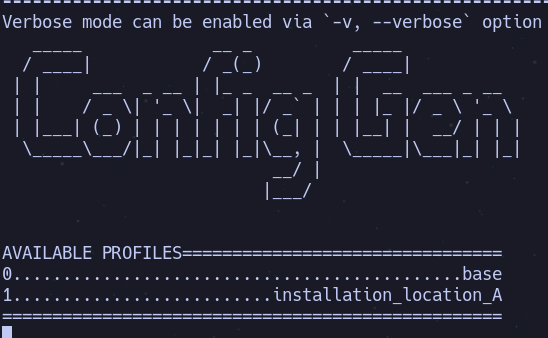

# Data Gator Documentation
This directory contains reference documentation for the data gator firmware solution. See the sections below for:

1. a high-level hardware description,
2. a firmware architecture description,
3. flowcharts!

##### Table of Contents

- [Firmware API Documentation](https://data-gator.github.io/doxygen_firmware_docs/index.html)
- [Building and Flashing Firmware](How_to_Flash_Firmware.md)
- [Configuration Files and Profiles](Configuration_Files_and_Creating_Profiles.md)
- [How to Make Firmware Releases](./how_to_make_releases.md)
- [Espressif Flash Tool](Espressif_Flash_Download_Tool.md)
- [How to Access Logged Data](How_To_Access_Logged_Data.md)
- [MQTT Topics](MQTT_Topics.md)
- [Sensor Guides](sensors_and_wiring/README.md)
- [Firmware States and Execution Description](firmware_documentation.md)

# Workflow for Users

_**Pre-requisites:** A data gator board with sensors and power supply. If you don't have these or want to know more about setting them up, see the hardware documentation in [github pages](https://data-gator.github.io/Hardware)_

1. Connect computer to board via USB. 
2. Install platformio with command line interface (CLI). Open a terminal and clone the firmware repository, then initialize all git submodules with the commands below:

        // clone firmware and these docs
        git clone https://github.com/Data-Gator/data-gator.git
        // add submodules and update them
        git submodule update --init --recursive

3. Use platformio for any of the following tasks:

    * [building/compiling code](How_to_Flash_Firmware.md) 
    * [building/compiling & uploading to Data Gator/uC](How_to_Flash_Firmware.md)
    * [select configuration options for board](Configuration_Files_and_Creating_Profiles.md)
    * [use unit tests to check functionality]()
    * [use espressif flash tool to flash pre-built firmware](Espressif_Flash_Download_Tool.md)

# Workflow for Firmware Developers

_**Pre-requisites:** A data gator board with sensors and power supply. Also some knowledge of C++ & Arduino concepts. If you don't have these or want to know more about setting them up, see the hardware documentation in [github pages](https://data-gator.github.io/Hardware)_

## Quick Links
It is assumed if you are a developer, you are interested in doing one of the following or have the skills to do whatever you want.

* [Detailed Firmware Execution Description](firmware_documentation.md)
* [Extending Firmware Functionality: New Sensors and Other Fun!](extending_firmware_functionality.md)
* [Doxygen Documentation for API](https://data-gator.github.io/doxygen_firmware_docs/index.html)

    * pre-built doxygen docs are available at the link above, but if you have doxygen installed on your system, build local doxygen docs from code with `doxygen datagator.doxyconfig` from root of repository.

* [Guide for Firmware Releases and the Version Tracking System](how_to_make_releases.md)
* [Guide for Using the Configuration Scripts](Configuration_Files_and_Creating_Profiles.md)
* [MQTT Topics Documentation](MQTT_Topics.md)

### Changing Configuration Options and Building a New Firmware Image

1. Edit `config.ini`. This file can be used to **add** global parameters or **modify** the values of default global definitions. At compile time, options from `config.ini` are used to generate `include/config.hpp` so that the parameters are available in the binary. _(default parameters listed below)_

    * Network ID
    * Network Password
    * MQTT Broker IP Address & Port 
    * Serial Debug Flag 
    * WiFi Connection Timeout
    * OTA Update Frequency
    * Other Task Frequencies

2. Run config generator script with:

        // to generate config.hpp
        pio run -e debug

3. Use script interface to select a configuration option from menu options which are loaded from `config.ini`. If no options are available, you want to add a configuration, or you want to change some values: repeat step one or refer to [the config guide](./Configuration_Files_and_Creating_Profiles.md).

###### Note
Until the config generator script is run again, every time the firmware is compiled, the values in `include/config.hpp` will be used. Open `config.ini` to check available values or open `include/config.hpp` to check what values are being compiled for use.

* if the script runs, you should see something similar to:

    
        

### Creating a New Firmware Release/Version

If creating a new a new firmware version/release is desired it is necessary to:

1. Choose configuration settings using the [configuration workflow](#changing-configuration-options-and-building-a-new-firmware-image).

2. Increment the firmware version number and build firmware image binary. For example if the current version is v1.0.12 the next version could be v2.0.0 (major release), v1.1.0 (minor release), or v1.0.13 (patch release). To automatically increment version number, run one of the following:

        // for a patch release (bug fixes)
        pio run -e rpatch

        // minor (non-api breaking changes)
        pio run -e rminor 

        // major (api breaking changes and major functionality upgrades)
        pio run -e rmajor

        // last resort to revert undesirable version and choose major, minor, and patch version manually
        // good for fixing oopsies!
        // warning overwrites existing version info!
        pio run -e rmanual

    - in this step, the old version number is retrieved from `include/version.hpp`, incremented and written back
    - if manual is used, the old version number is simply overwritten

3. Get generated binary from `.pio` directory.

    - after step 2, the binary file will be placed in `.pio/build/<rmajor|rminor|rpatch>/datagator_v<major>.<minor>.<patch>.bin`

### Adding and Integrating Support For a New Sensor

