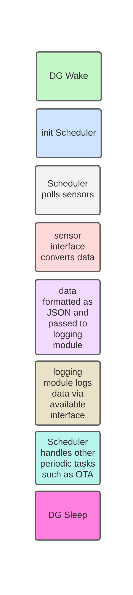

# Firmware Configuration and Usage
The firmware for this project can be configured in various ways and the goal of this document is to explain various execution steps. This guide is aimed at developers extending functionality as well as those who need to know some technical details for troubleshooting. 

## Quick Notes on the Arduino Platform
Although this firmware is written using the Arduino platform/API, it does not follow the "continuous loop" model which Arduino uses through the automatic `void loop()` call. 

Normal arduino execution follows this order:

1. Globals statements that appear before functions.
2. `void setup() {...}`, is called once
3. `void loop() {...}`, is called repeatedly until the microprocessor is placed in a sleep state, is reset, or loses power.

This project, however, is designed with power efficiency in mind and therefore wakes to take sensor readings and perform tasks but then goes back to sleep immediately. Thus, `loop()` and setup are EACH called just once and loop serves as the container for calling major modules such as the scheduler and logging modules. If changes need to be made to the source code, which involve running a task repeatedly, do not place those additions in the `loop()` definition.

## Firmware Execution Flowchart
The image below shows, from top to bottom the sequence executed by the firmware.

## Firmware State Descriptions
| State | Description | 
| --- | --- | 
| DG Wake | Data gator wakes from sleep state, this is triggered either by the co-processor or the watchdog timer
| init Scheduler | After waking, the scheduler routine increments the number of resets (times woken from sleep, used for timing) and sets/clears flags for tasks | 
| sensor interface converts data | Sensor readings are taken. |
| data formatted as JSON | Sensor readings are converted to JSON strings, chosen for human readable qualities, and uploaded to server |
| logging module logs data | It is possible for multiple avenues of logging to be used for each device. This is implemented using a logging module. | 
| Scheduler handles periodic tasks | If a periodic task has been added to the firmware, this is when it will run. |
| DG Sleep | Data gator enters the low power sleep state where all memory and pins are turned off. |

###### NOTE
At various points in the process above the DG will check for MQTT commands sent to the device. This can drastically affect the execution order as long data pull requests can really bog things down.

