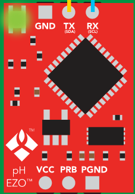
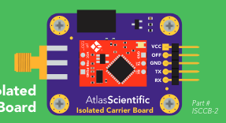
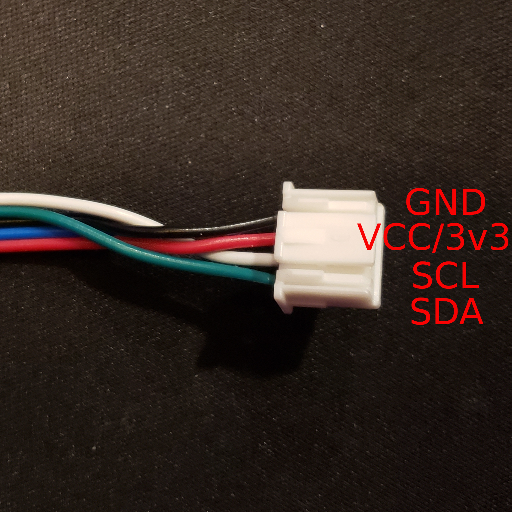

# Atlas EZO-pH Sensor (UART/I2C)

| Resource | Contents |
| :---: | :---: | 
| [Purchase Link](https://atlas-scientific.com/kits/ph-kit/#) | Pricing, specs, and links to documentation |
| [Datasheet](https://files.atlas-scientific.com/pH_EZO_Datasheet.pdf) | Documentation of wiring and usage in UART/I2C mode |

#### EZO-pH Module

#### EZO-pH Module on Carrier Board (top view)
Note that the pin labels on the bottom of the carrier board(purple) correspond to the I2C mode pin mapping. 

## Usage

By default this sensor is factory configured to operate in UART mode. This is great because it allows the user to interface with the sensor using a laptop or other PC using a USB-to-Serial converter, often an FTDI cable.

However, in cases where multiple sensors are needed or for embedded applications it is more helpful to calibrate and configure the sensor's parameters in UART mode and then change to I2C mode for use with an embedded system like the Data Gator.

The steps for this process are listed below:

1. Connect sensor to PC using FTDI cable.
2. Calibrate and configure sensor using the serial interface.
3. Set sensor to  I2C mode and configure address as needed.
4. Connect sensor to DG and use!

Instructions for each of these steps will be included below.

### Connecting to Sensor via FTDI Cable 

FTDI cables will have a USB connector on one end while the other end will have jumper connectors to interface between the FTDI chip and the sensor or micro-controller. The connection table lists which wires should be connected between the sensor carrier board and the FTDI cable.

#### FTDI-to-EZO-pH Connection Table

| FTDI | EZO-pH Carrier Board | 
| :---: | :---: | 
| GND | GND | 
| CTS | Not Connected(NC) | 
| VCC(or 5V from USB) | VCC | 
| TXD | RX | 
| RXD | TX | 
| DTA | NC | 

###### NOTE
It is important that the TXD of the FTDI be connected to the RX of the EZO-pH board and vice a versa for the RXD and TX pins. If TXD is connected to TX and RXD to RX, no data will be transmitted to or from the board.

#### Opening Serial Interface on PC
There are a few serial monitor options available, but since this project is built and maintained with PlatformIO, these instructions will use the built-in serial monitor.

To open the serial monitor enter the following command in your terminal(or the visual studio code terminal):

    pio device monitor -b 9600

This will open a serial monitor running at 9600 baud, the default baud rate of the sensor. 

If you notice all data is being printed on one line, try using the command below to modify the newline character of the terminal.

    pio device monitor -b 9600 --eol CR

This has been observed to work better in some cases because the carriage return character is the command and data transmission terminator used by the EZO-pH module whereas the default line terminator in the PlatformIO serial monitor is CRLF(carriage return followed by a line feed).

The default sensor read setting in UART mode is continuous mode, which means that readings are continuously taken from the sensor and printed to the serial interface. To make sure this is happening:

1. Check that the module is powered on. If so, the LED should be blinking green and blue. If not, the module is not powered on so check wiring and USB connection.
2. Verify that the TXD and RXD lines are properly wired. If they are, you should see a pH value printed to the serial monitor every couple of seconds.

###### If you see nothing or gibberish printed to the terminal, but the LED on the module is ON
Check to make sure your TXD and RXD lines are wired correctly, maybe try swapping them.

### Calibrating Sensor via Serial Interface 

Once you have a serial monitor open and are receiving data from the device, you should be able to use the commands defined by Atlas Scientific for controlling the device. These are well documented in the datasheet linked at the top of this guide.

As stated by the documentation, the process for calibrating the module is as follows: 

1. Read the 7.0 pH buffer with the sensor. Once the readings have stabilized enter the command `Cal, mid, <pH_reading_here>` and press enter to submit the command with a carriage return. If successful, the sensor module should respond by printing `*OK` to the monitor.

    * _**Note:**_ Sending the midpoint calibration command(above) clears all other calibration data on the chip. This is because calibrating the midpoint equates to a single point calibration.

2. Read the 4.0 pH buffer. Then enter `Cal, low, <pH_reading_here>`.
3. Finally read the 10.0 pH buffer and calibrate with `Cal, high, <pH_reading_here>`.

Once those commands are executed, the calibration status of the sensor can be queried with `Cal,?` which will return `?Cal,0` if not calibrated, or `?Cal,<number_1-3>` to indicate calibration with however calibration points were used.

### Set Sensor to I2C Mode and Configuring Address
Use command 
    
    `I2C,<i2c_addr_here>` 

to set I2C address and reboot in I2C mode. After rebooting the LED should remain blue to indicate that it is operating in I2C mode.

The I2C address should be chosen from three possible values, `0x01`, `0x02`, or `0x03`. No more than one pH sensor with the same address may be connected to the same aggregator at a time, and the address assigned should correspond to the relative depth that the sensor is buried at with `0x01` being the most shallow.

### Wiring to DGv1.5+

Below is the connection table for the EZO-pH carrier board when in I2C mode. 

#### EZO-pH-to-I2C Connection Table

| Atlas EZO-pH (top label) | Atlas EZO-pH (bottom label) | Aggregator | 
| :---: | :---: | :---: | 
| VCC | VCC | 3v3 | 
| OFF | OFF | NC | 
| GND | GND | GND | 
| TX | SDA | SDA | 
| RX | SCL | SCL |

