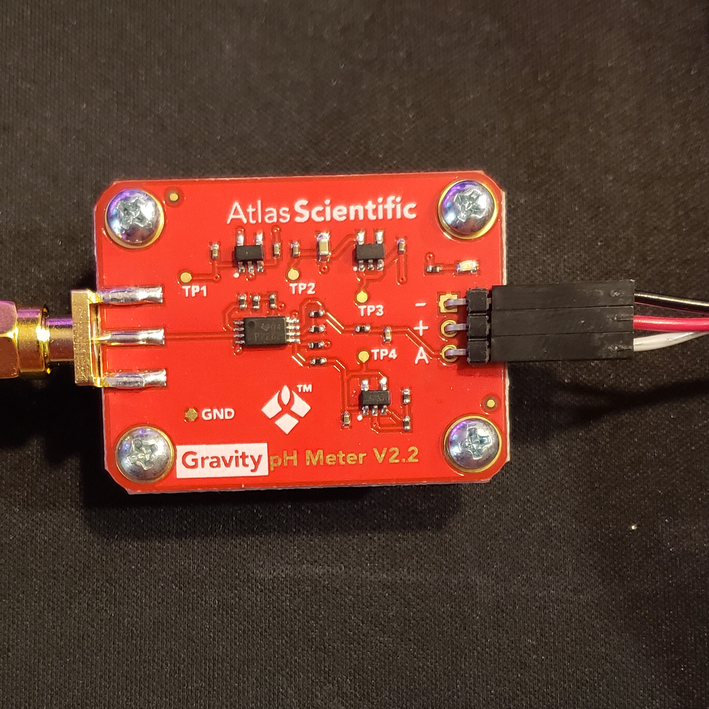
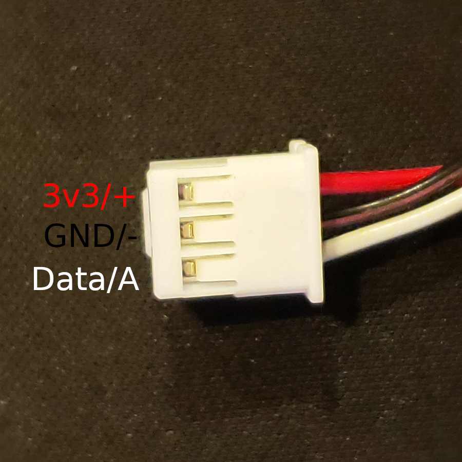

# Atlas Gravity pH Sensor (Analog)

| Resource | Contents | 
| :---: | :---: |
| [Purchase Link](https://atlas-scientific.com/kits/gravity-analog-ph-kit/) | Atlas Scientific storefront link, page also contains documentation links and specs | 
| [Datasheet](https://files.atlas-scientific.com/Gravity-pH-datasheet.pdf) | Documentation on operation, specs, and wiring diagrams | 

### Wiring Diagram

The pictures below show the wiring of the jumper wires between the sensor and the 3 pin connector which is used to connect to the analog ports on the aggregator board, hardware version 1.5 and later.

#### Connection Chart
| Gravity pH | Aggregator |
| :---: | :---: |
| `-` | GND | 
| `+` | 3v3 | 
| `A` | SIG | 

