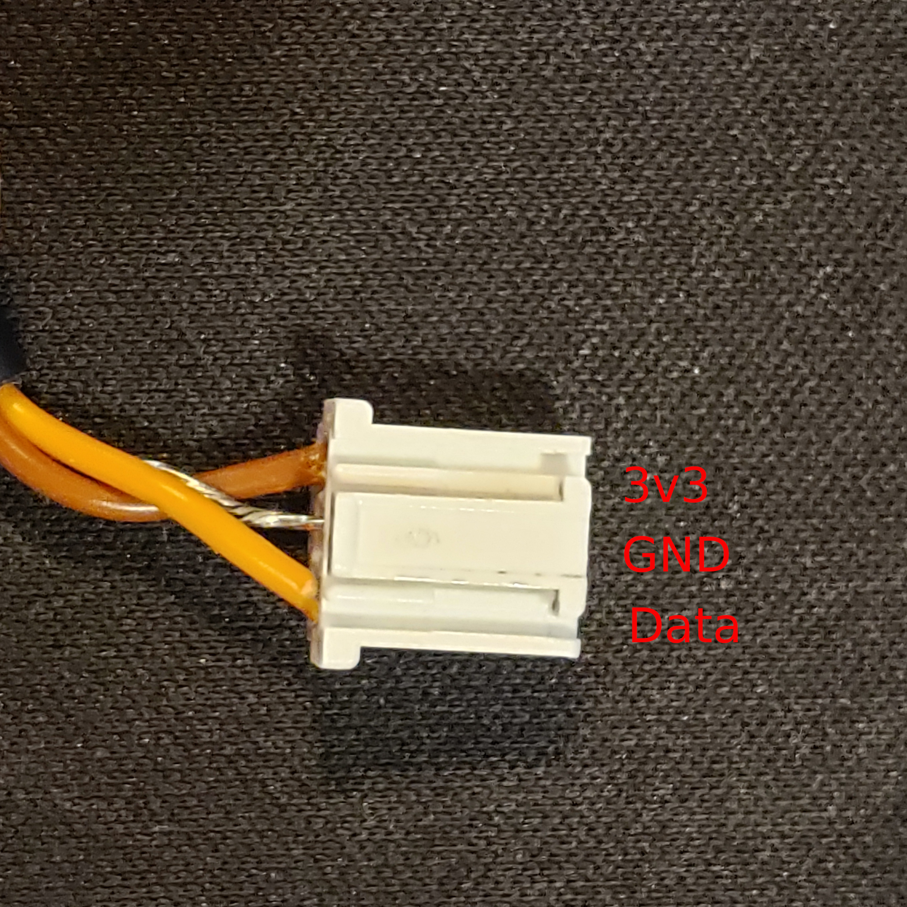
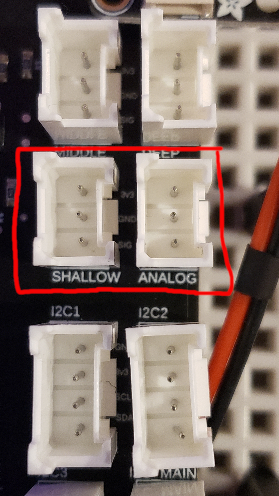

# Meter Teros 10 VWC Sensor (Analog)

| Resource | Contents | 
| :--: | :---: | 
| [Purchase Link](https://www.metergroup.com/en/meter-environment/products/teros-10-soil-moisture-sensor) | Quote request, specs, and company contacts | 
| [Datasheet](https://publications.metergroup.com/Manuals/20788_TEROS10_Manual_Web.pdf) | Installation and wiring instructions, calibration for soils, and specifications | 

### Wiring Diagram
See chart and pictures below for wiring this sensor to the aggregator board. Supported for versions 1.4+.

#### Connection Chart
| Meter Teros 10 | Aggregator | 
| :---: | :---: | 
| Brown(Power) | 3v3 | 
| Bare(GND) | GND | 
| Orange(Data) | SIG |

